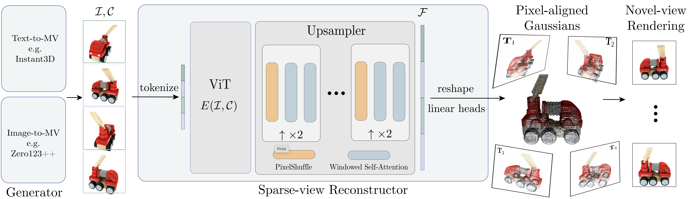

# GRM: Large Gaussian Reconstruction Model for Efficient 3D Reconstruction and Generation




> **GRM: Large Gaussian Reconstruction Model for Efficient 3D Reconstruction and Generation** <br>
> Yinghao Xu, Zifan Shi, Wang Yifan, Hansheng Chen, Ceyuan Yang, Sida Peng, Yujun Shen, Gordon Wetzstein<br>

[[Paper](https://arxiv.org/abs/2403.14621)]
[[Project Page](https://justimyhxu.github.io/projects/grm)]
[[Blender Demo](https://github.com/justimyhxu/GRM/assets/29980330/0cf713aa-ba87-4a15-a8ee-1b0da643cb3c)]
[[HF Demo](https://huggingface.co/spaces/GRM-demo/GRM)]

### The code and models will be released soon!

## Results

### Blender Demo
https://github.com/justimyhxu/GRM/assets/29980330/0cf713aa-ba87-4a15-a8ee-1b0da643cb3c

### Sparse-view Reconstruction
https://github.com/justimyhxu/GRM/assets/29980330/d436bca9-ddf9-4507-aed3-828fd6508ec3

### 3D Generation
https://github.com/justimyhxu/GRM/assets/29980330/32f41f04-5ebe-4aa4-b1b7-bf4f78e5f197


## BibTeX

```bibtex
@article{xu2024grm,
     author    = {Xu, Yinghao and Shi, Zifan and Yifan, Wang and Peng, Sida and Yang, Ceyuan and Shen, Yujun and Wetzstein Gordon},
     title     = {GRM: Large Gaussian Reconstruction Model for Efficient 3D Reconstruction and Generation},
     journal   = {arxiv: 2403.14621},
     year      = {2024},
    }
```
